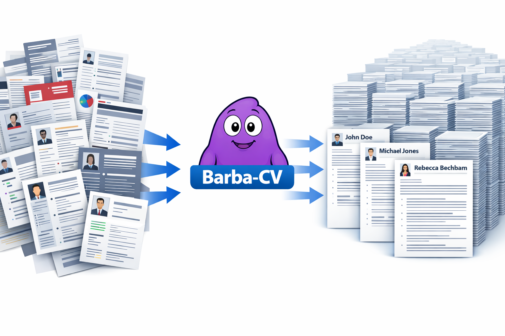

# Visual Overview

Barba-CV provides a deterministic structured layer between unstructured CV documents and AI / ATS systems.

## The Problem

CVs are unstructured documents with highly variable layouts and content styles, which makes consistent machine processing difficult.

Common issues include:

- PDF parsing problems
- inconsistent formatting
- ATS incompatibilities
- difficulty for AI systems to reliably extract structured data

## The Barba-CV Approach

Barba-CV introduces:

- a deterministic JSON structure
- a schema describing the structure
- a flexible semantic layer for real-world CV variability

## Conceptual Pipeline

CV document  
↓  
Text extraction  
↓  
LLM mapping using Barba-CV example JSON  
↓  
Barba-CV structured JSON  
↓  
HR systems / ATS / AI agents / MCP services

## Why this matters for AI systems

Barba-CV enables:

- deterministic structured CV data
- interoperability between AI systems
- reliable HR data pipelines
- schema-driven parsing
