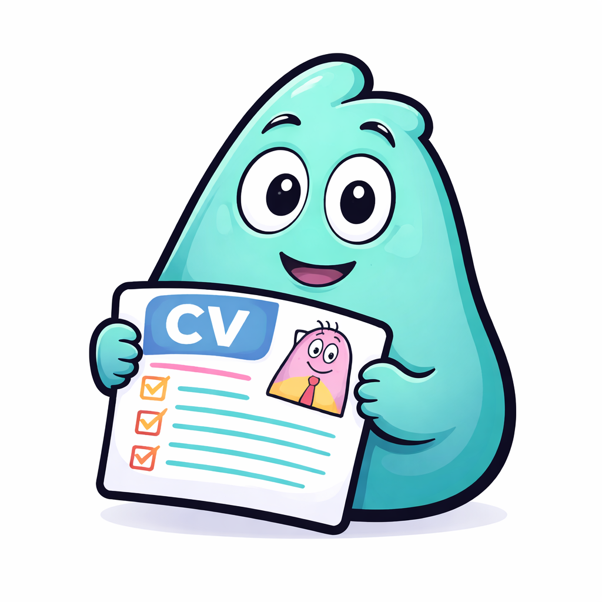

<h1>
Barba-CV

</h1>

Barba-CV is an open, vendor-neutral JSON specification for deterministic, machine-readable CV/resume data.

## Documentation

- [Documentation Hub](./docs/)
- [Visual Overview](./docs/visual-overview.md)
- [Design Principles](./docs/design-principles.md)
- [LLM Integration](./docs/llm-integration.md)
- [AI Parsing Guidelines](./docs/ai-parsing-guidelines.md)
- [Examples](./examples/)
- [Roadmap](./roadmap/)
- [Origin](./origin/)

> “CV data is inherently heterogeneous—often incomplete, inconsistently structured, and partially normalized. The Barba-CV schema therefore enforces deterministic structure while preserving semantic flexibility, allowing real-world CV data to be represented without unrealistic constraints.”

## Conceptual Pipeline

1. Unstructured CV (PDF/DOCX)
2. AI/LLM extraction (probabilistic)
3. Barba-CV schema mapping (deterministic)
4. Structured CV data for interoperability

## What it is / is not

**Barba-CV is:**
- an open, vendor-neutral data standard
- a deterministic JSON schema for CV structure
- a shared format for AI extraction pipelines and ATS interoperability

**Barba-CV is not:**
- a parser service in this repository
- a public API or SDK
- a replacement for separate service-layer projects

## Quick links

- [Schema (`schema/barba-cv.schema.json`)](./schema/barba-cv.schema.json)
- [Examples (`examples/`)](./examples/)
- [Design principles](./design-principles/)
- [AI parsing guidance](./ai-parsing-guidance/)
- [Roadmap](./roadmap/)
- [Project origin](./origin/)
- [License (`LICENSE`)](./LICENSE)
